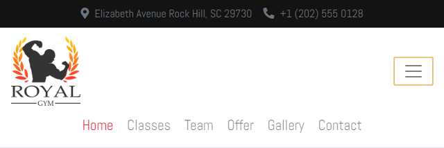
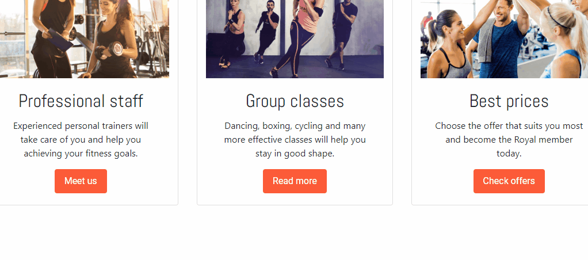
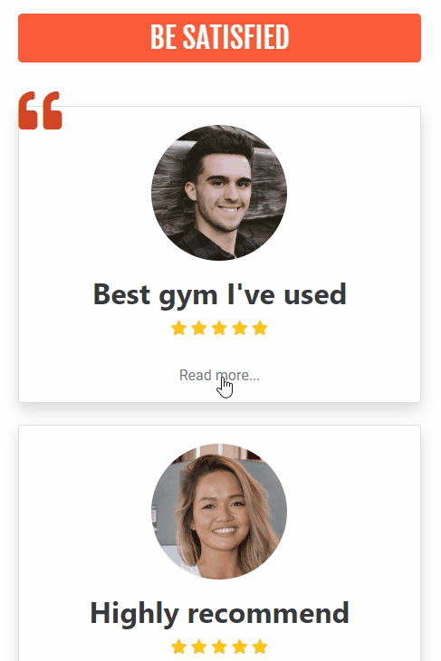
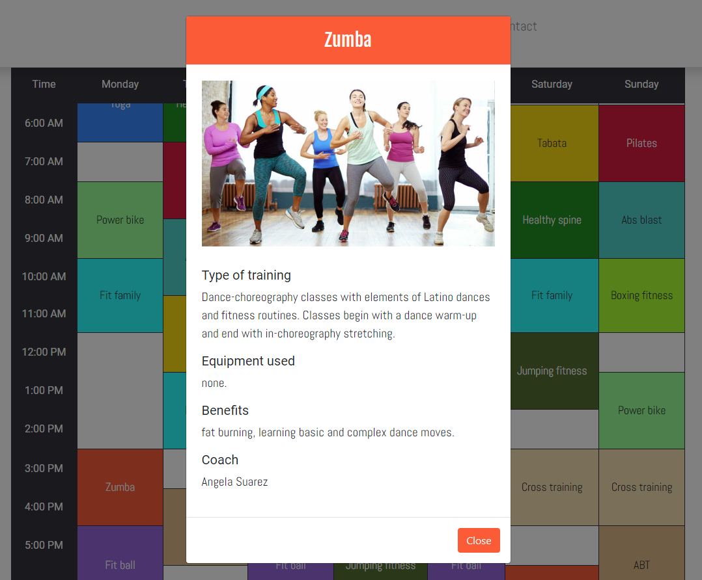
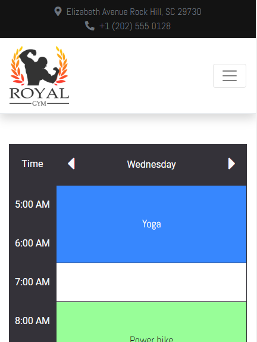
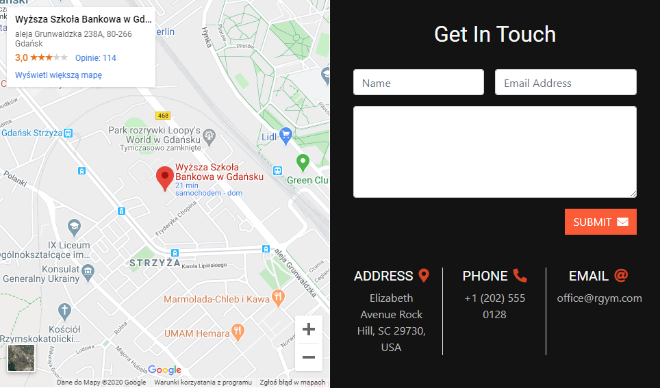

<p align="center">
  
</p>

<br>

# **1. Wprowadzenie**

Projekt przedstawia fikcyjny klub fitness **Royal Gym**. Witryna została przygotowana w oparciu o podstawowe technologie, powszechnie znane frameworki, a także dodatkowe biblioteki:

* HTML5
* CSS3
* Bootstrap 4
* jQuery
* [AOS](https://michalsnik.github.io/aos/ "Animate On Scroll Library")


# **2. Budowa strony**

Budowa strony bazuje na 12-kolumnowym układzie znanym z Bootstrapa. Nagiwacja, responsywność oraz style wykorzystują wbudowane we wspomnianą bibliotekę klasy.

## **2.1 Nawigacja**

Pasek menu oprócz standardowej funkcjonalności zapewnionej przez Bootstrapa został rozbudowany o sposób wyświetlania zakładek podczas zmiany orientacji na urządzeniach mobilnych na tzw. *landscape view*, tak by rozmieszczone były one w jednej linii:

<br>

<p align="center">
  
</p>

<br>

```css
@media only screen and (max-width: 767px) and (orientation: landscape){
    .navbar-nav{
        display: block;
    }
    .nav-item{
        display: inline-block;
    }
}
```

## **2.2 Zakładka Home**

Zakładka Home przedstawia najistotniejsze informacje takie jak: hasło reklamowe, najważniejsze cechy siłowni, wyposażnie klubu oraz opinie jego członków.

### **__2.1.1 Część główna__**

Część główna to tzw. *showcase*. Jego tło stanowią dwie wastwy: *background-image* z parametrem *fixed* oraz *gradient*. Na pierwszym planie znajduje się natomiast kontener ze sloganem i odnośnikiem do oferty oraz dodatkowe zdjęcie. 

Kontener ze sloganem oraz jego składowe wykorzystują efekty z bilioteki *AOS*, takie jak *zoom-in*, czy *fade-right*. Efekty te przypisywane są poprzez atrybut ```data-aos```. Dodatkowo za pomocą ```data-aos-delay``` określone mogą zostać opóźnienia wykonania poszczególnych animacji. Pełną listę efektów biblioteki *AOS* oraz jej parametrów do edycji można znaleźć [pod tym adresem](https://michalsnik.github.io/aos/ "Animate On Scroll Library").

<br>

<p align="center">
  
</p>

<br>

```html
<div id="sloganContainer" data-aos="zoom-in" class="col-xl-6 col-md-12 mx-0 py-4 px-4 my-auto text-center rounded-lg">
  <div id="slogan">
    <p data-aos="fade-right" data-aos-delay="200" class="display-2 font-anton text-orangered text-uppercase">Be part of Royal family</p>
    <h2 data-aos="fade-right" data-aos-delay="400" class="font-abel">get the body you want at the gym you love</h2>
    <a href="offer.html" data-aos="fade-down" data-aos-delay="600" class="btn bg-orangered text-white font-roboto py-2 px-4 mt-xl-4 mt-3">JOIN NOW</a>
  </div>
</div>
```

W celu zainicjalizowania biblioteki *AOS* należy do pliku HTML załączyć poniższy skrypt:

```JavaScript
AOS.init({
    once: true,
    duration: 500
}); 
```

### **__2.1.2 Wyposażenie siłowni__**

Kolejną częścią wartą pokazania jest sekcja przedstawiająca wyposażenie siłowni za pomocą ikon z animowanymi liczbami. 

<br>

<p align="center">
  
</p>

<br>

Funkcją główną jest funkcja ```countOnScroll```. Na początku w instrukcji warunkowej sprawdzany jest wynik zwracany przez funkcję ```isScrolledIntoView``` oraz stan zmiennej ```viewed``` odpowiedzialnej za to, by animacja wykonana została tylko jeden raz. Funkcja ```isScrolledIntoView``` sprawdza, czy użytkownik podczas scrollowania sprawił, że pożądany element jest w pełni widoczny i zwraca wartość ```true``` jeżeli tak jest. 

Następnie wykonywania jest animacja każdego elementu z klasą ```value```. Animacja polega na zliczaniu od 0 do liczby pobranej za pomocą selektora ```$(this).text()```, w czasie wskazanym poprzez parametr ```duration```.


```JavaScript
$(window).scroll(countOnScroll);

var viewed = false;

function isScrolledIntoView(elem) {
    var docViewTop = $(window).scrollTop();
    var docViewBottom = docViewTop + $(window).height();
    var elemTop = $(elem).offset().top;
    var elemBottom = elemTop + $(elem).height();

    return ((elemBottom <= docViewBottom) && (elemTop >= docViewTop));
}

function countOnScroll() {
    if (isScrolledIntoView($(".numbers")) && !viewed) {
        viewed = true;

        $('.value').each(function (){
          $(this).prop('Counter',0).animate({Counter: $(this).text()}, 
          {
              duration: 4000,
              easing: 'swing',
              step: function (now) {
                  $(this).text("+"+Math.ceil(now));
              }
          });
        });
    }    
}
```

### **__2.1.3 Opinie członków__**

Ostatnią sekcją na podstronie Home jest część związana z feedbackiem. Przy większej rozdzielczości kolumny z opiniami użytkowników pokazane są w całości, w jednym rzędzie. Na urządzeniach mobilnych natomiast są one wyświetlane jedna pod drugą, a dodatkowo komentarze członków są ukryte. Użyta została tutaj te sama klasa Bootstrapa co w przypadku nawigacji, tj. ```collapse```, a powiązanie przycisku *Read more* z komentarzem uzyskano przez atrybuty ```data-collapse``` oraz ```data-target```.

<br>

<p align="center">
  
</p>

<br>

## **2.3 Zakładka Classes**

W zakładce Classes w postaci tabeli pokazany został rozkład zajęć prowadzonych w klubie fitness. Po kliknięciu na w daną komórkę wyświetlany jest *modal* zawierający szczegóły dotyczące wybranych zajęć. Szczegóły dotyczące zajęć takie jak zdjęcie, opis, czy nazwisko prowadzącego przechowywane są w zagnieżdzonym obiekcie ```classes```. 

<p align="center">
  
</p>

```JavaScript
var classes = 
{
    yoga: 
    {
        Name: "Yoga",
        Image: "images/yoga.jpg",
        Type: "The class involves working with the body, respiration and the mind. It leads to harmony and internal balance.", 
        Equipment: "blankets, rollers, blocks, yoga belts, chairs.", 
        Benefits: "body shaping, improvement in well-being and health, reduction of stress.", 
        Coach: "John Simonson"
    },
    
    [...]

}
```

Kliknięcie w komórkę z zajęciami powoduje pobranie wartości atrybutu ```data-class```. Na podstawie tej wartości, z obiektu ```classes``` przekazane zostają do *modala* informacje o odpowiednich zajęciach. Atrybut ten służy również do ustalenia kolorystyki otwieranego okna, gdyż jego wartość stanowi część nazwy klasy określającej kolor tła elementów *modala*.

```html
<td rowspan="2" data-day="monday" data-class="zumba" class="classCell bg-zumba font-abel text-light">Zumba</td>
```

```css
.bg-zumba{
    background-color: #ff5733;
}
```

```JavaScript
var classCell = "";

$('.classCell').click(function(){
    classCell = $(this).data('class');
    
    $('#className').text(classes[classCell]["Name"]);
    $('#className').css('color', $(this).css('color'));
    $('#classImage').attr('src', classes[classCell]["Image"]);
    $('#classType').text(classes[classCell]["Type"]);
    $('#classEquipment').text(classes[classCell]["Equipment"]);
    $('#classBenefits').text(classes[classCell]["Benefits"]);
    $('#classCoach').text(classes[classCell]["Coach"]);

    $('.modal-header').attr('class', 'modal-header bg-' + classCell);
    $('.modal-footer button').attr('class', 'btn bg-' + classCell);
    $('.modal-footer button').css('color', $(this).css('color'));

    $('#modalClass').modal();
});
```

Rozkład zajęc został przygotowany w taki sposób, że przy mniejszej rozdzielczości wyświetlany jest tylko jeden dzień tygodnia. Zmiana dnia tygodnia możliwa jest za pomocą dodatkowych przycisków. Funkcjonalność tą osiągnięto przy wykorzystaniu atrybutu ```data-day``` widocznego powyżej. Każda z komórek tabeli przypisana ma do siebie dany dzień tygodnia, dzięki czemu przy przełączaniu kolumn na dzień poprzedni/dzień następny możliwe jest wyselekcjonowanie tych komórek, które mają być wyświetlone od tych które powinny zostać ukryte. 

<br>

<p align="center">
  
</p>

<br>

Budowa komórki z nazwą dnia tygodnia oraz omawianymi przyciskami prezentuje się jak poniżej:

```html
<td data-day="monday" class="bg-gray text-light font-roboto">
  <div class="d-flex align-items-center">
    <button class="btn btnPreviousDay py-0 my-0"><i class="fas fa-caret-left fa-2x text-light"></i></button>
    <span>Monday</span>
    <button class="btn btnNextDay py-0 my-0"><i class="fas fa-caret-right fa-2x text-light"></i></button>
  </div>
</td>
```

Przykładowo przycisnięcie przycisku mającego za zadanie pokazać dzień poprzedni powoduje wykonanie kolejno:
* pobranie atrybutu ```data-day``` najbliższego elementu ```td``` i przypisanie go do zmiennej ```dayOfweek```
* przypisanie indeksu tabeli ```days``` pod którym znajduje się szukany dzień do zmiennej ```numberOfDay```
* dekrementacja liczby przechowywanej w zmiennej ```numberOfDay```, po to aby wskazywała indeks tabeli odpowiadający dniu poprzedniemu
* ukrycie wszystkich komórek tabeli z wyjątkiem pierwszej kolumny w której znajdują się godziny zajęć
* pokazanie tylko tych komórek tabeli, których atrybut ```data-day``` odpowiada ustalonemu dniu

```JavaScript
var dayOfWeek;
var numberOfDay;
var days = ['monday','thuesday','wednesday','thursday','friday','saturday','sunday'];

$('.btnPreviousDay').click(function(){

    dayOfWeek = $(this).closest('td').data('day');
    numberOfDay = days.indexOf(dayOfWeek);

    if(numberOfDay-1 < 0){
        dayOfWeek = 'sunday';
    } else{
        dayOfWeek = days[numberOfDay-1];
    }

    $('table td:not(:nth-child(1)').hide();
    $('table td[data-day=' + dayOfWeek + ']').show();

});
```
## **2.4 Zakładka Team oraz Offers**

W zakładce Team oraz Offer użyte zostały wyłącznie klasy *"Bootstapowe"* służące do płynnej zmiany rozmiaru zdjęć oraz uzyskania responsywności.

## **2.5 Zakładka Contact**

Podstrona Contact zawiera prosty formularz kontaktowy oraz mapę Google z wybranymi współrzędnymi. 

<br>

<p align="center">
  
</p>

<br>

```html
<div class="map-responsive border border-white">
    <iframe style="border: none; overflow: hidden;" src="https://maps.google.com/maps?q=WSB%20Gda%C5%84sk&t=&z=15&ie=UTF8&iwloc=&output=embed"></iframe>
</div>
```

W celu zapewnienia responsywności mapy konieczne było wprowadzenie dodatkowych parametrów w arkuszu stylów:

```css
.map-responsive{
    overflow:hidden;
    position:relative;
    height:100%;
    min-height: 500px;
    z-index: 2;
}
.map-responsive iframe{
    height:100%;
    width:100%;
}
```


